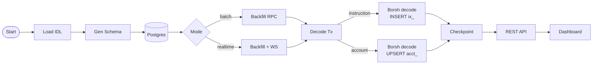

# frostgum

Universal Solana Indexer with Dynamic Schema & API. Point it at any [Anchor](https://anchor-lang.com/) program, and it auto-generates typed PostgreSQL tables from the IDL, decodes every instruction and account state in real-time, and exposes a queryable REST API with a live dashboard.

Built for the [Superteam Ukraine bounty](https://earn.superteam.fun/).

---

## How it works



---

## Architecture

| Layer | What it does |
|---|---|
| **IDL Loader** | Fetches IDL from a local file or derives the on-chain address via `find_program_address(&[]) → create_with_seed("anchor:idl")`, then decompresses zlib-encoded JSON |
| **Schema Generator** | Maps every IDL type (`u64`, `Vec<T>`, `Option<T>`, defined structs/enums) to a PostgreSQL column type and emits `CREATE TABLE IF NOT EXISTS` DDL |
| **Borsh Decoder** | Recursively decodes instruction args and account fields by walking the IDL type tree against raw bytes |
| **Indexer — Batch** | Reads `last_slot` checkpoint, pages through `getSignaturesForAddress2` backwards, decodes and inserts each transaction |
| **Indexer — Realtime** | Cold-start backfill → `logsSubscribe` WebSocket → reconnects with exponential backoff + jitter |
| **API** | Axum 0.7 REST endpoints with dynamic `row_to_json` queries, aggregation support, and a guarded raw SQL console |
| **Dashboard** | Vanilla JS SPA — floating nav, live stat polling, DB table browser, SQL console |

---

## Features

- **Universal** — works with any Anchor program, no code changes needed
- **Dynamic schema** — tables auto-created from IDL at startup
- **Dual mode** — `batch` for historical backfills, `realtime` for live WebSocket indexing with cold-start
- **Full type decoding** — primitives, `Vec`, `Option`, arrays, nested structs, enums
- **Account state tracking** — Borsh-decodes account data with discriminator matching
- **Exponential backoff** — all RPC calls retry with jitter up to a configurable ceiling
- **Aggregation API** — `SUM`, `AVG`, `COUNT`, `MIN`, `MAX` over any decoded column
- **Guarded SQL console** — `SELECT`-only raw query endpoint
- **Structured logging** — JSON-formatted via `tracing`
- **Graceful shutdown** — SIGINT-aware tokio select

---

## Quick start

### 1. Clone and configure

```bash
git clone https://github.com/carsonpine/frostgum
cd frostgum
cp .env.example .env
```

Edit `.env`:

```env
HELIUS_RPC_URL=https://mainnet.helius-rpc.com/?api-key=YOUR_KEY
PROGRAM_ID=JUP6LkbZbjS1jKKwapdHNy74zcZ3tLUZoi5QNyVTaV4
INDEX_MODE=realtime
```

### 2. Run with Docker Compose

```bash
docker compose up
```

That's it. Frostgum pulls the pre-built image from GHCR, spins up Postgres, fetches the IDL on-chain, generates the schema, and starts indexing.

Open `http://localhost:3000` for the dashboard.

---

## Environment variables

| Variable | Required | Default | Description |
|---|---|---|---|
| `HELIUS_RPC_URL` | yes | — | Helius (or any Solana) RPC endpoint |
| `HELIUS_WS_URL` | no | derived from RPC URL | WebSocket endpoint for realtime mode |
| `POSTGRES_URL` | yes | — | PostgreSQL connection string |
| `PROGRAM_ID` | yes | — | Base58 program address to index |
| `IDL_PATH` | no | — | Path to local IDL JSON (skips on-chain fetch) |
| `INDEX_MODE` | no | `realtime` | `batch` or `realtime` |
| `START_SLOT` | no | — | Slot to start backfill from |
| `END_SLOT` | no | — | Slot to stop batch indexing at |
| `BATCH_SIZE` | no | `100` | Signatures per RPC page |
| `API_PORT` | no | `3000` | HTTP API port |
| `RPC_MAX_RETRIES` | no | `8` | Max RPC retry attempts |
| `RPC_INITIAL_BACKOFF_MS` | no | `250` | Initial backoff in ms |
| `RPC_MAX_BACKOFF_MS` | no | `30000` | Max backoff ceiling in ms |

---

## API reference

```
GET  /health
GET  /api/meta                                              current slot + table count
GET  /programs                                              registered programs
GET  /programs/:id/stats                                    instruction row counts
GET  /programs/:id/instructions                             IDL instruction list
GET  /programs/:id/instructions/:name?limit&offset&order   decoded instruction rows
GET  /programs/:id/instructions/:name/aggregate?fn&col     aggregation query
GET  /programs/:id/accounts                                 IDL account type list
GET  /programs/:id/accounts/:type?limit&offset             decoded account rows
GET  /programs/:id/accounts/:type/:address                  single account by address
POST /api/sql                                               raw SELECT query
```

---

## Dynamic schema

For a program with label `jup6lkbzbjS1` (last 10 alphanumeric chars), frostgum generates:

```sql
-- one table per instruction
CREATE TABLE IF NOT EXISTS ix_jup6lkbzbjS1_route (
    id          BIGSERIAL PRIMARY KEY,
    signature   TEXT NOT NULL,
    slot        BIGINT NOT NULL,
    block_time  BIGINT,
    signer      TEXT,
    accounts    TEXT,
    in_amount   BIGINT,
    quoted_out_amount BIGINT,
    slippage_bps INT,
    platform_fee_bps INT,
    route_plan  JSONB,
    created_at  TIMESTAMPTZ NOT NULL DEFAULT NOW()
);

-- one table per account type
CREATE TABLE IF NOT EXISTS acct_jup6lkbzbjS1_token_ledger (
    id           BIGSERIAL PRIMARY KEY,
    address      TEXT NOT NULL UNIQUE,
    slot_updated BIGINT,
    raw          JSONB,
    ...fields...,
    updated_at   TIMESTAMPTZ NOT NULL DEFAULT NOW()
);
```

Reserved column names (`id`, `signature`, `slot`, etc.) are automatically prefixed with `arg_` to avoid conflicts.

---

## Running against a different program

Change `PROGRAM_ID` in `.env` to any Anchor program that publishes its IDL on-chain:

```env
# Meteora DLMM
PROGRAM_ID=LBUZKhRxPF3XUpBCjp4YzTKgLccjZhTSDM9YuVaPwxo

# Drift Protocol
PROGRAM_ID=dRiftyHA39MWEi3m9aunc5MzRF1JYuBsbn6VPcn33UH
```

Restart and frostgum re-derives the IDL and regenerates the schema automatically.

---

## Tech stack

- **Rust** — tokio async runtime, zero-cost abstractions
- **Axum 0.7** — HTTP API
- **sqlx 0.8** — async Postgres with dynamic `PgArguments` binding
- **solana-sdk / solana-rpc-client 2.1** — RPC + transaction parsing
- **borsh 1.3** — binary deserialization matching Anchor's encoding
- **tokio-tungstenite** — WebSocket for `logsSubscribe`
- **sha2** — Anchor discriminator derivation
- **flate2** — zlib decompression of on-chain IDL accounts
- **PostgreSQL 16** — typed dynamic storage
- **Docker + GHCR** — pre-built image, `docker compose up` and go

---

## CI/CD

Push to `master` → GitHub Actions builds with Docker Buildx + GHA layer cache → pushes `latest` and `sha-*` tags to `ghcr.io/carsonpine/frostgum`.

`docker-compose.yml` uses `pull_policy: always` so `docker compose up` always gets the freshest image.

---

## Dashboard

| Section | What it shows |
|---|---|
| **Floating nav** | Current indexed slot, table count, online status |
| **Home → Instruction Counts** | Per-instruction row counts with hover tooltips, live-refreshed every 5s |
| **Home → Instructions tab** | Paginated decoded instruction rows, sub-tabs per instruction type |
| **Home → Account States tab** | Paginated decoded account data |
| **Data → DB Tables** | Click any table to auto-query it in the SQL console |
| **Data → SQL Console** | `SELECT`-only raw query runner |
